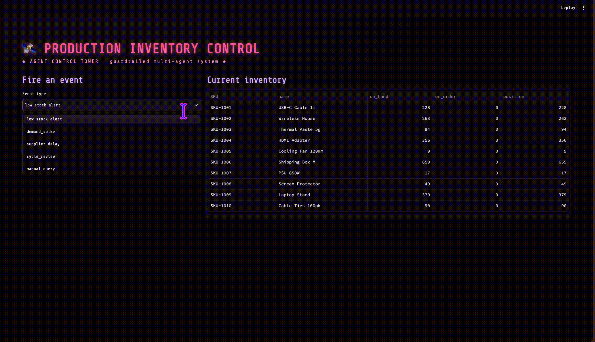
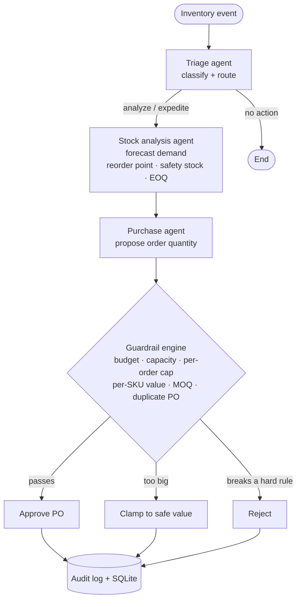

# Inventory Control Agents

A multi-agent system that decides inventory restocking. It reads demand and stock
levels, forecasts what's needed, and generates purchase orders — but every order
has to pass a guardrail layer first, so the agents can't over-order, go over
budget, or overflow the warehouse.

Built with LangGraph. The LLM is pluggable: it runs offline with a deterministic
backend by default (no API key needed), or against a real LLM if you set one.



## Architecture



The agents never do the arithmetic and are never trusted with safety: the numbers
come from the forecasting/optimization modules, and every proposed order must
pass the guardrail engine before it can become a real purchase order.

## How it works

Three agents run as a LangGraph workflow:

1. **Triage** – classifies the incoming event (low stock, demand spike, supplier
   delay, periodic review) and routes it.
2. **Stock analysis** – forecasts demand and computes reorder point, safety
   stock, and EOQ for each SKU.
3. **Purchase** – proposes order quantities, which then go through the guardrail
   engine before becoming actual POs.

The guardrails are plain deterministic checks (budget cap, warehouse capacity,
max units per order, per-SKU value cap, minimum order quantity, no duplicate
POs). If a proposed order breaks a rule it gets clamped to a safe value or
rejected, and the reason is logged. Forecasting picks its method based on the
demand pattern — Croston's for intermittent/spare-part demand, exponential
smoothing or Holt for smooth or trending demand.

## Running it

```bash
python3 -m venv .venv
source .venv/bin/activate
pip install -r requirements.txt

make seed        # generate synthetic demand data
make demo        # run a full review through the agents
make test        # run the test suite
make evals       # run the safety-scenario checks
make dashboard   # Streamlit UI
make api         # FastAPI service
```

No API key required — the default backend is deterministic. To use a real LLM,
`pip install langchain-openai`, then set `LLM_PROVIDER=openai` and
`OPENAI_API_KEY` (see `.env.example`).

## Tests and evals

The `tests/` folder covers the forecasting, optimization, and guardrail logic,
plus an end-to-end graph test. The `evals/` folder runs a few adversarial
scenarios and checks the system holds its invariants — e.g. a demand spike can't
breach the per-order cap, and 20 hungry SKUs can't exceed the budget.

```bash
make test    # 19 tests
make evals   # 4 scenarios
```

## Project structure

```
src/inventory_agents/
  graph.py          LangGraph assembly
  agents/           triage, stock analysis, purchase
  forecasting.py    demand forecasting
  optimization.py   EOQ, safety stock, reorder point
  guardrails.py     the guardrail engine
  llm.py            pluggable LLM (offline default + OpenAI adapter)
  db.py             SQLite persistence
  api.py            FastAPI endpoints
dashboard/          Streamlit UI
evals/              scenario checks
tests/              pytest suite
data/               synthetic data generator
```

## Stack

Python, LangGraph, Pydantic, FastAPI, Streamlit, SQLite.
